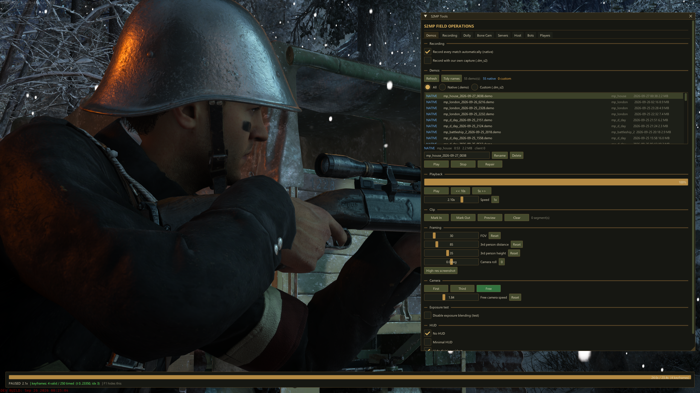
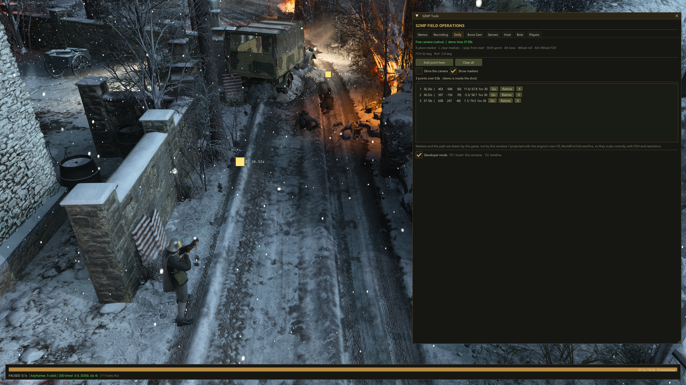
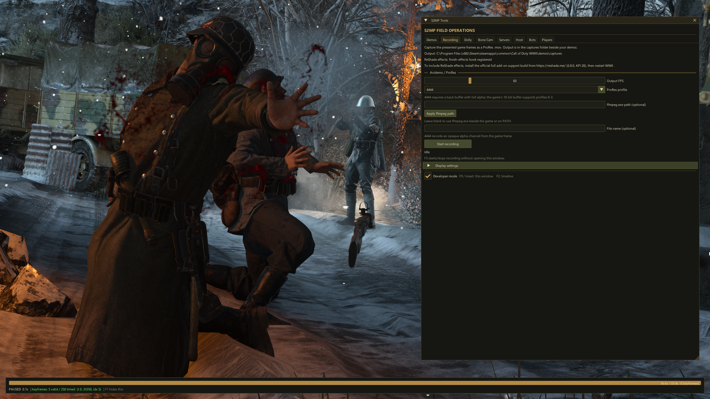
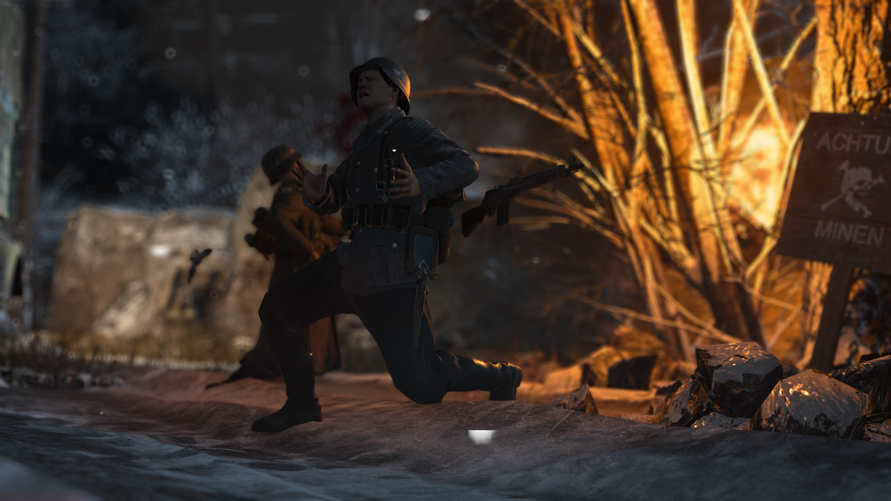

# S2MP Mod v1.0.1

Demo, camera, and recording tools for people making cinematics inside Call of Duty: WWII.

[Rattpak made the original S2MP Mod](https://github.com/Rattpak/S2MP-Mod). [Josh (josh155) built the demo-w2dr branch](https://github.com/josh155/S2MP-Mod/tree/demo-w2dr) and did about 90% of the work on this version. Josh handed the project to Polito and approved its release. serv tested the builds and helped catch issues. The original Git history is still here; [CREDITS.md](CREDITS.md) has the source and third-party credits.

Polito now works on 3D cinematics. This client is here for people who still film inside the game.

v1.0.1 is Build 34. It keeps the Build 30-based cinematic tools, sets `dolly_slow_clock 0` by default, and raises the `com_maxfps` limit to 1000.

## Install

1. Download [S2MP-Mod-v1.0.1-build-34.zip](https://github.com/Politohh/S2MP-Mod-Polito/releases/download/v1.0.1/S2MP-Mod-v1.0.1-build-34.zip) and extract it.
2. Close WWII. Put both S2MP-Launcher.exe and s2mp-mod.dll next to your s2_mp64_ship.exe, replacing any older copies.
3. Start S2MP-Launcher.exe and choose Multiplayer. Press F9 or Insert to open the tools menu.

The ZIP includes the launcher, mod DLL, instructions, and hashes. It does not include the game, FFmpeg, or ReShade.

## Quick controls

- Record a match or open a demo in the Demos tab. F1 opens the timeline.
- Go to Dolly and turn on **Drive the camera**. K places a camera point, L removes the last one, and J rewinds and plays the path.
- Left Arrow skips the demo back ten seconds. In free cam, use the mouse wheel for roll or Alt + wheel for FOV. Camera speed and demo timescale are in the menu.
- The camera tools include FOV, roll, third-person framing, and No HUD.
- The Recording tab can capture ProRes through FFmpeg. F5 starts or stops capture. ReShade effects need the compatible add-on setup in [RESHADE-SETUP.txt](docs/RESHADE-SETUP.txt).
- CineBot is there for private/custom matches. ADS + your Use key spawns a bot at the crosshair; F7 moves the selected bot and F8 toggles freeze.

This rollback also includes the Host, Servers, Players, and developer controls from Build 30.

## In game

The dolly path, with three camera points placed in a demo:

The Recording tab, set up for ProRes:

An example in-game frame:

## Build from source

On Windows, use Visual Studio 2022 with the C++ desktop workload and Windows SDK. Run tools/premake5.exe vs2022, then build s2mp-mod.sln as Release | x64. The DLL will be in bin/Release/. The launcher is a separate upstream binary.

For bug reports, include the fresh `main/s2mp_console.log`. For bot issues, also include `S2CineBot.log` from the game directory.
