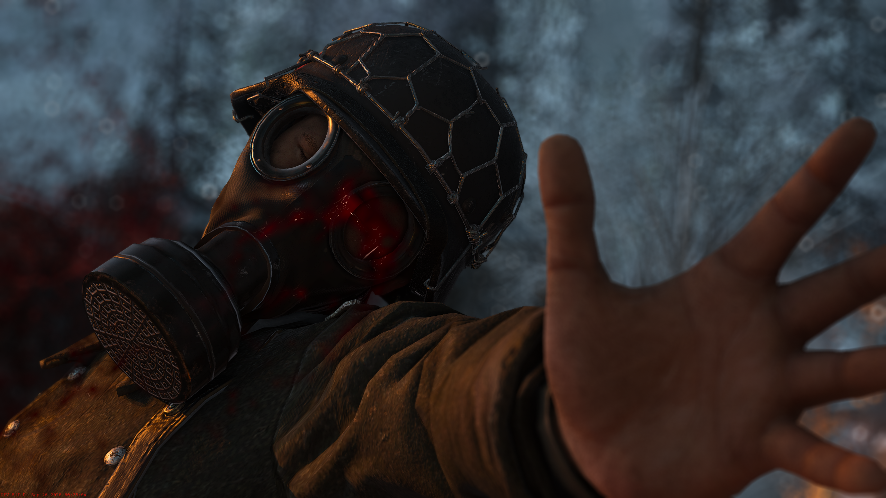

# S2MP Mod v1.0.7

Demo, camera, and recording tools for people making cinematics inside Call of Duty: WWII.

You can also play normally on Steam servers with the client running. Turn on automatic match recording in the Demos tab, then open a saved demo later to watch what happened or film it with the free camera and dolly tools.

[Rattpak made the original S2MP Mod](https://github.com/Rattpak/S2MP-Mod). [Josh (josh155) built the demo-w2dr branch](https://github.com/josh155/S2MP-Mod/tree/demo-w2dr) and did about 90% of the work on this version. Josh handed the project to me and approved its release. serv tested the builds and helped catch issues. The original Git history is still here; [CREDITS.md](CREDITS.md) has the source and third-party credits.

v1.0.7 is Build 40. J now selects the free camera before starting a dolly path, stopping a demo closes the tools menu to release its input capture, and camera roll also applies to custom demos. This release also includes the config-loading and map-cleanup changes since Build 35. FFmpeg is included, `dolly_slow_clock` stays off by default, and the `com_maxfps` limit is 1000.

## Install

1. Download [S2MP-Mod-v1.0.7-build-40.zip](https://github.com/Politohh/S2MP-Mod-Demo/releases/download/v1.0.7/S2MP-Mod-v1.0.7-build-40.zip) and extract it.
2. Close WWII. Copy the extracted files and folders into your WWII game folder, next to s2_mp64_ship.exe. Replace older copies when asked.
3. Start S2MP-Launcher.exe and choose Multiplayer. Press F9 or Insert to open the tools menu.

The ZIP includes the launcher, mod DLL, FFmpeg for ProRes recording, instructions, and hashes. The client finds the included ffmpeg.exe automatically. You still need your own copy of the game; ReShade is optional and installed separately.

## Quick controls

- Record a match or open a demo in the Demos tab. F1 opens the timeline.
- Go to Dolly and turn on **Drive the camera**. K places a camera point, L removes the last one, and J rewinds and plays the path.
- Left Arrow skips the demo back ten seconds. In free cam, use the mouse wheel for roll or Alt + wheel for FOV. Camera speed and demo timescale are in the menu.
- The camera tools include FOV, roll, third-person framing, and No HUD.
- The Recording tab captures ProRes with the included FFmpeg. F5 starts or stops capture. ReShade effects need the compatible add-on setup in [RESHADE-SETUP.txt](docs/RESHADE-SETUP.txt).
- CineBot is there for private/custom matches. ADS + your Use key spawns a bot at the crosshair; F7 moves the selected bot and F8 toggles freeze.

Host, Servers, Players, and developer controls are also included.

## In game

The dolly path, with three camera points placed in a demo:

The Recording tab, set up for ProRes:

Example in-game frames:

## Build from source

On Windows, use Visual Studio 2022 with the C++ desktop workload and Windows SDK. Run tools/premake5.exe vs2022, then build s2mp-mod.sln as Release | x64. The DLL will be in bin/Release/. The launcher is a separate upstream binary.

For bug reports, include the fresh `main/s2mp_console.log`. For bot issues, also include `S2CineBot.log` from the game directory.
